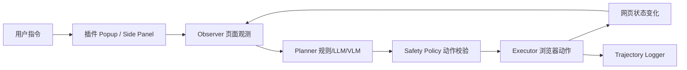

# 系统架构设计

## 目标

构建一个浏览器辅助操作智能体 Demo。用户用自然语言描述任务，系统读取当前网页状态，生成可解释动作计划，并通过浏览器插件执行点击、输入、滚动、导航、提取内容等动作。

第一版目标不是完全无人值守，而是“可控辅助”：

- 默认展示计划和原因，再由用户点击执行。
- 高风险动作需要显式确认。
- 每一步记录日志，便于课程报告中的轨迹可视化和错误分析。

## 分层

## 核心循环

1. `Observer` 采集网页标题、URL、可见文本、可交互元素、元素坐标。
2. `Planner` 根据用户指令和页面状态生成动作列表。
3. `Safety Policy` 校验动作是否在白名单内，拦截提交、删除、付款、发送等高风险动作。
4. `Executor` 执行动作，并将结果写入日志。
5. 用户可以继续输入下一条指令，或让系统根据新状态继续规划。

## 模块边界

- `extension/content.js`：页面观测、元素标号、高亮、动作执行。
- `extension/planner.js`：任务意图识别、候选元素匹配、动作计划生成。
- `extension/popup.js`：用户交互、调用 Planner、展示计划、触发执行。
- `demo-site/index.html`：本地测试站点，覆盖搜索、表单、消息回复三类任务。
- `scripts/serve_demo.py`：启动本地静态服务器。
- `third_party/`：保留 GitHub 参考仓库，作为方案依据，不参与 Demo 运行。

## 后续扩展点

- 将 `planner.js` 的 `planTask()` 替换为 OpenAI-compatible API、Qwen2.5-VL 或本地 VLM。
- 将 `popup.html` 升级为 `side_panel`，获得持续对话体验。
- 引入 Playwright/browser-harness，对同一任务执行 10 次并统计成功率。
- 为常见网站沉淀 `domain skills`，例如课程网站、GitHub、问卷系统、邮箱/IM 页面。
