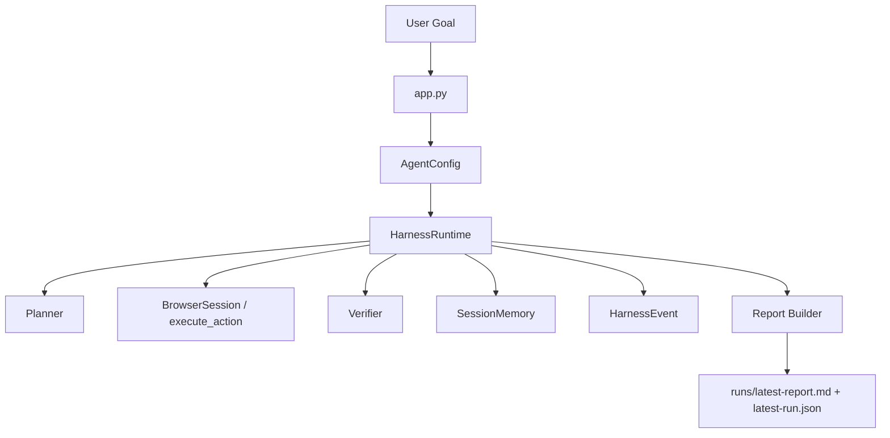

# Harness 架构总览

这篇文档只讲一件事：当前仓库里的 Harness 到底是怎么组织起来的。这里不谈过程记录，也不谈验收报告，只围绕真实代码说明运行结构。

## 1. 先看整体定位

当前项目的核心不是某一个 planner，也不是某一组浏览器动作，而是 `browser_agent/harness/runtime.py` 里的 `HarnessRuntime`。

它承担的是运行时编排职责：

- 接收用户目标
- 决定走哪条执行路径
- 驱动浏览器动作或场景动作
- 调用 verifier
- 写入 memory
- 记录 event
- 生成最终 report

因此，“Harness” 在这里不是一个辅助模块，而是整个系统的中心。

## 2. 系统总图



最重要的一点是：这些模块不是并列关系，而是由 `HarnessRuntime` 串起来。

## 3. 两条主执行路径

`HarnessRuntime.run()` 会先判断，这次任务应该走哪条路：

1. `_run_scenario()`
2. `_run_workflow()`

这两条路径分别服务于两种不同类型的任务。

### 3.1 场景型路径 `_run_scenario()`

这一条更适合：

- 表单填写
- 预订/预约
- 线索采集
- 页面监控
- QA 回归

它的特点是：

- 动作更固定
- 风险边界更明确
- 敏感操作可以暂停等待审批
- 更接近“可控流程执行器”

这条路使用的数据结构主要是：

- `Plan`
- `Action`
- `verify_step()`

### 3.2 研究型路径 `_run_workflow()`

这一条更适合：

- GitHub 仓库调研
- 论文检索与比较
- 商品比较与推荐
- 视频内容提取与整理

它的特点是：

- 更强调 observation 和 evidence
- 动作选择可以由 LLM 动态驱动
- 每一步都有 verifier 与 fallback
- 最终目标是形成结构化报告

这条路使用的数据结构主要是：

- `WorkflowSpec`
- `WorkflowNode`
- `ActionResult`
- `VerificationResult`
- `StructuredArtifact`

## 4. 核心协议层

整个 Harness 能成立，靠的是 `browser_agent/types.py` 里那一组统一数据结构。它们决定了模块之间如何通信。

### `Observation`

`Observation` 表示“系统眼中的当前页面状态”。它不只是一个 URL，而是把一轮规划可能用到的页面信息都收进来：

- `url`
- `title`
- `text`
- `elements`
- `screenshot_path`
- `accessibility_tree`
- `form_fields`
- `visible_buttons`
- `visual_summary`
- `extracted_fields`

因此 Planner 或 LLM 读到的不是原始 Playwright 对象，而是一个已经标准化过的页面观察结果。

### `Action` 与 `Plan`

这组结构主要服务于场景型路径。

- `Action` 表示一个确定性工具动作
- `Plan` 表示一组动作以及场景级元数据

例如一个 booking 场景，planner 会先把目标转成 `search -> find_slots -> apply_filters -> reserve` 这样的动作序列。

### `WorkflowNode` 与 `WorkflowSpec`

这组结构主要服务于研究型路径。

- `WorkflowSpec` 是一次研究任务的工作流容器
- `WorkflowNode` 是其中某一步实际执行节点

一个 `WorkflowNode` 至少包含：

- `id`
- `instruction`
- `action`
- `inputs`
- `success_criteria`
- `retry_policy`

它比简单的 `Action` 更丰富，因为研究型路径需要表达动作输入、成功标准和重试策略。

### `ActionResult`

浏览器执行器把每一步结果都包装成 `ActionResult`，而不是直接把原始页面对象往外传。

这里通常会包含：

- `ok`
- `action`
- `url`
- `title`
- `text`
- `fields`
- `evidence`
- `error`
- `fallback_used`

这样做的好处是，Verifier、Memory、Report Builder 都不依赖浏览器库内部对象。

### `VerificationResult`

Verifier 输出的是结构化验证结果，而不是一个布尔值：

- `ok`
- `score`
- `checks`
- `retry_hint`

其中 `retry_hint` 很重要，因为 Harness 要靠它决定下一步是重试、换动作还是降级。

### `StructuredArtifact`

这是最终面向用户交付的结构化报告对象。它把一次运行积累的证据和结论组织成统一格式，例如：

- `summary`
- `candidates`
- `source_readings`
- `recommendations`
- `comparison_matrix`
- `uncertainties`
- `next_actions`
- `citations`

这说明系统的最终目标不是“执行动作本身”，而是“交付证据化结果”。

## 5. Planner 在 Harness 里扮演什么角色

Planner 不直接控制浏览器，它负责把用户目标转成可执行结构。

当前 `browser_agent/planner/tot.py` 主要做三件事：

1. `detect_domain()`
   根据关键词判断目标更接近 `github`、`paper`、`shopping`、`video` 还是 `general`。

2. `plan_scenario_goal()`
   为场景型任务生成 `Plan`。

3. `plan_goal()` / `plan_workflow_goal()`
   为研究型任务生成 `WorkflowSpec` 骨架。

这里的关键点是：Planner 负责“定方向”，但不单独负责“把整条链跑完”。真正把这些结构落实成执行的是 Harness。

## 6. Browser 层在 Harness 里的作用

Browser 层不是单纯的工具函数集合，而是 Harness 和真实网页之间的接口层。

当前有两种不同形态：

### 6.1 `execute_action()`

这是场景型路径里的确定性动作执行接口。它更像 harness-safe 的受控动作分发器。

优点是：

- 动作集合明确
- 输出格式稳定
- 适合演示受控流程

### 6.2 `BrowserSession`

这是研究型路径里的真实浏览器执行器，内部基于 Playwright。

它负责：

- 打开页面
- 搜索
- 收集候选链接
- 打开候选页面
- 抽取页面内容
- 重新组织页面观察

从 Harness 的角度看，BrowserSession 的意义不只是“执行动作”，还包括“为下一轮规划准备 Observation”。

## 7. Verifier 为什么是 Harness 的关键模块

没有 Verifier，这个系统就会退化成普通自动化脚本。

`browser_agent/verifier/critic.py` 当前实现虽然不大，但位置非常关键。它会检查：

- 动作成功没有
- URL 是否存在
- 是否拿到了 evidence 或 fields
- 某些抽取动作是否真的有内容

当结果不满足条件时，Verifier 给出 `retry_hint`，Harness 再依据这个提示决定：

- 重新尝试
- 切到 fallback
- 直接终止

因此系统真正的闭环是：

```text
observe -> plan -> act -> verify -> retry/fallback -> remember -> report
```

而不是简单的 `plan -> act -> done`。

## 8. Memory 在整个架构中的位置

当前 `browser_agent/memory/session.py` 是会话级 memory，实现上很轻，但角色很重要。

它主要保存两类信息：

- `traces`
- `evidence`

它的作用不是长期记忆用户，而是：

1. 让运行过程可追踪
2. 让最终报告能回到具体证据

也就是说，当前 Memory 是“运行时证据仓”，而不是“长期知识库”。

## 9. Event 机制为什么单独存在

`browser_agent/harness/events.py` 定义了 `HarnessEvent` 与 `make_event()`。

这套机制把每一步执行都标准化为事件，包含：

- `run_id`
- `step_id`
- `phase`
- `tool`
- `input`
- `output`
- `latency_ms`
- `url`
- `ts`

这一层存在的意义是把运行日志从“零散 print”升级成“可分析、可回放的结构化轨迹”。

它也是当前项目区别于很多简单 agent demo 的重要地方。

## 10. Output 模块如何收口

`browser_agent/output/report_builder.py` 和 `markdown.py` 负责把前面所有中间结果收口成用户可读结果。

这里的设计原则很清楚：

- Output 不直接依赖浏览器状态
- Output 只消费 workflow、memory 和 step outputs
- 最终先生成结构化 artifact，再渲染成 Markdown

这种做法让报告层和执行层解耦，也方便后续替换成其他输出形式，例如 API 响应或前端卡片。

## 11. LLM 在 Harness 中的真实位置

LLM 现在不是整个系统唯一的控制核心，而是作为增强层出现。

它主要在两个地方介入：

1. 动态规划
   `browser_agent/llm/agent.py` 的 `plan_next_action()` 会根据 Observation、Memory 和 checklist 选择下一步动作。

2. 报告增强
   `build_llm_report()` 会在已有结构化结果基础上生成更自然的总结和建议。

也就是说，当前系统的稳定性更多来自 Harness，而不是完全来自 LLM 本身。

## 12. 当前架构最值得注意的边界

把边界说清楚，比把系统说得过满更重要。

### 已经比较清楚的部分

- HarnessRuntime 是明确中心
- 两条路径划分清楚
- 类型协议比较完整
- Verifier / Memory / Events / Report 已经接入主链路

### 仍然偏早期或占位的部分

- 场景路径的 `observe()` 目前还是 stub
- 长期 memory 仍未真正展开
- 视觉能力是扩展位，不是全路径核心
- 多代理协作还没有成为真正的一等架构

## 13. 用一句话总结当前 Harness

当前仓库里的 Harness，本质上是一套把“目标理解、浏览器执行、结果验证、证据沉淀和结构化交付”串成统一运行时闭环的架构，而不是一组零散的浏览器自动化脚本。
