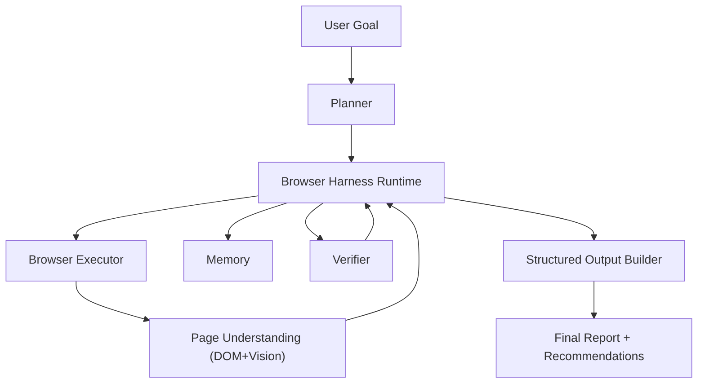
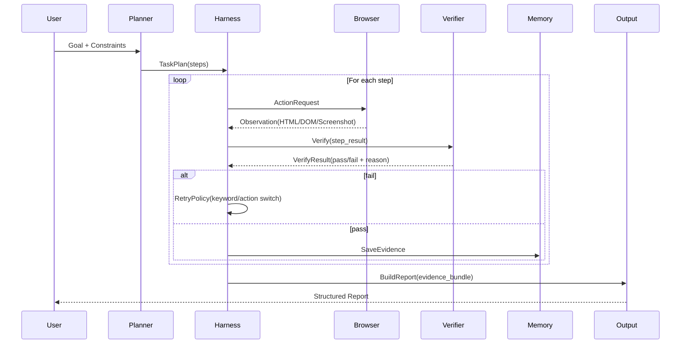

# 系统模块图（含接口）

## 1. 总体模块图



## 2. 运行时时序图



## 3. 统一接口定义

### 3.1 `ResearchRequest`

```json
{
  "request_id": "req_xxx",
  "domain": "github|paper|shopping|video",
  "goal": "帮我找多模态 OOD 相关开源项目",
  "constraints": {
    "language": "zh",
    "time_range": "last_2_years",
    "max_candidates": 20
  },
  "user_profile": {
    "budget": null,
    "preferences": ["开源活跃", "可复现"]
  }
}
```

### 3.2 `TaskPlan`

```json
{
  "plan_id": "plan_xxx",
  "steps": [
    {
      "step_id": "s1",
      "type": "search",
      "objective": "找到候选仓库",
      "success_criteria": ["至少10个候选", "star>50"]
    },
    {
      "step_id": "s2",
      "type": "inspect",
      "objective": "解析README和issue活跃度",
      "success_criteria": ["提取技术路线", "最近3个月有提交"]
    }
  ]
}
```

### 3.3 `ActionRequest` / `Observation`

```json
{
  "action": "goto|click|type|scroll|extract",
  "target": "css/xpath/text/vision_bbox",
  "payload": {"url": "https://github.com/search?q=..."},
  "timeout_ms": 15000
}
```

```json
{
  "obs_id": "obs_xxx",
  "url": "https://github.com/...",
  "title": "Repo page",
  "dom_snapshot": "...",
  "screenshot_path": "runs/.../step2.png",
  "extracted_fields": {
    "stars": 1200,
    "last_commit_days": 8
  }
}
```

### 3.4 `VerificationResult`

```json
{
  "step_id": "s2",
  "pass": true,
  "score": 0.86,
  "checks": [
    {"name": "required_fields", "pass": true},
    {"name": "evidence_quality", "pass": true}
  ],
  "retry_hint": null
}
```

### 3.5 `EvidenceItem`

```json
{
  "evidence_id": "ev_xxx",
  "source_type": "github|arxiv|scholar|video",
  "source_url": "https://...",
  "claim": "该方法使用视觉-语言联合编码",
  "support": "README段落/论文摘要/代码片段",
  "confidence": 0.81,
  "timestamp": "2026-05-27T10:00:00Z"
}
```

### 3.6 `StructuredReport`

```json
{
  "summary": "...",
  "recommendations": [
    {"name": "Repo A", "reason": "活跃+文档完善+指标领先"}
  ],
  "comparison_table": [],
  "uncertainties": ["X仓库缺少完整训练脚本"],
  "next_actions": ["优先复现Top-2项目"]
}
```

## 4. 模块边界约束

- Planner 不直接调用浏览器，只产出步骤和成功标准。
- Harness 是唯一编排入口，负责重试、回退、状态机推进。
- Verifier 不生成最终结论，只做事实与质量校验。
- Memory 不参与动作执行，只提供检索和偏好注入。
- Output 模块只消费证据，不依赖网页实时状态。

## 5. 可观测性接口（建议）

### `EventLog`

```json
{
  "event_id": "evt_xxx",
  "run_id": "run_xxx",
  "module": "harness|browser|verifier|planner",
  "event_type": "step_start|action|observation|verify|retry|step_end",
  "payload": {},
  "ts": "2026-05-27T10:00:00Z"
}
```

最小落地要求：
- 每一步必须有 `step_start` 和 `step_end`
- 每次 retry 必须记录 `retry_reason` 和 `strategy`
